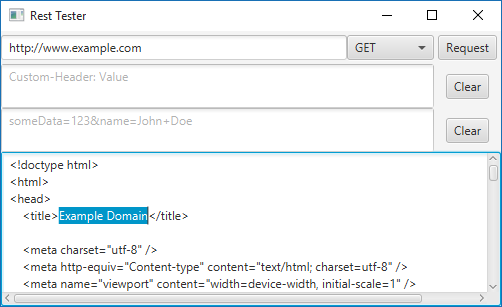

# Rest Tester

## Description

Rest Tester is a Java GUI program for testing HTTP requests.



## Features

* Test HTTP requests with GET, PUT, POST, DELETE, PATCH
* Specify custom headers
* Specify custom post data
* View text results

## Installing

You must first compile the source. After compiling you can run Main.class or you can create a .jar for convenience.

### Compiling and Creating Jar

```
git clone https://github.com/DevDungeon/RestTester
cd RestTester/src
javac RestTester/*.java
jar cfm RestTester.jar META-INF/MANIFEST.MF RestTester
```

## Running

```
java -jar RestTester.jar
```

Download the JAR
----------------
* [Rest Tester from DevDungeon.com](http://www.devdungeon.com/content/rest-tester)


Source Code
-----------
* [Rest Tester (GitHub.com)](https://www.github.com/DevDungeon/RestTester)

## Contact

NanoDano nanodano@devdungeon.com

## License

MIT

## Changelog

v1.0 - 2015/12/29 - Initial stable version complete